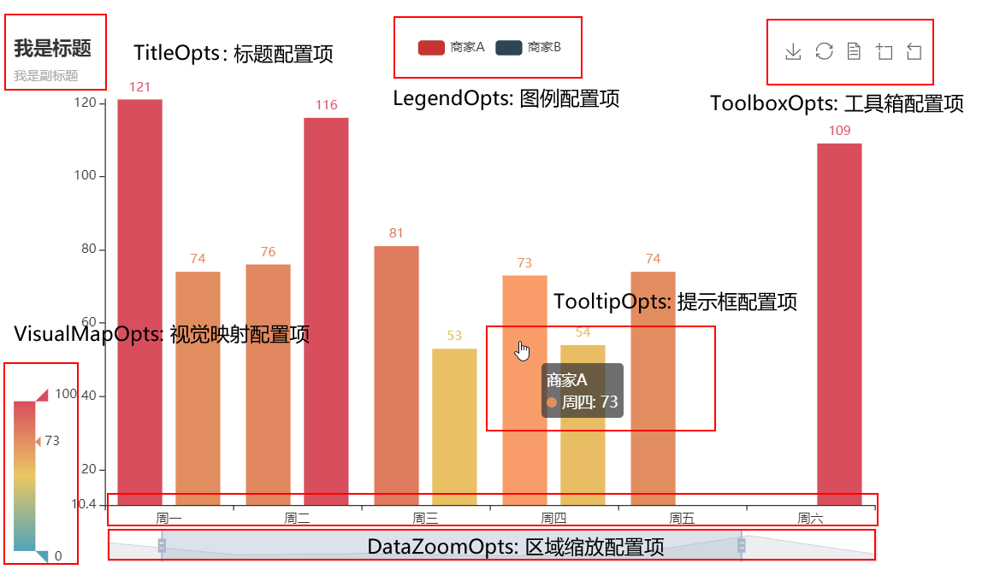

# **pyechart教程**


## 基本介绍

### 安装pyecharts包
* pip install pyecharts
* pip install pyecharts-jupyter-installer

地图相关的包

* pip install echarts-countries-pypkg  
* pip install echarts-china-provinces-pypkg 
* pip install echarts-china-cities-pypkg 
* pip install echarts-china-counties-pypkg
* pip install echarts-china-misc-pypkg 
* pip install echarts-united-kingdom-pypkg

### 导入包


```python
from pyecharts.globals import CurrentConfig, NotebookType,ThemeType,OnlineHostType
CurrentConfig.NOTEBOOK_TYPE = NotebookType.JUPYTER_LAB

import pyecharts.options as opts
from pyecharts.charts import Bar, Line,Grid
from pyecharts.faker import Faker
from pyecharts.commons.utils import JsCode
import numpy as np
```

### 两种编程方式
* [全局参数设置]( https://pyecharts.org/#/zh-cn/global_options?id=axisopts%ef%bc%9a%e5%9d%90%e6%a0%87%e8%bd%b4%e9%85%8d%e7%bd%ae%e9%a1%b9)



# bar教程


```python

# 方式一

bar = Bar()
bar.add_xaxis(["衬衫", "羊毛衫", "雪纺衫", "裤子", "高跟鞋", "袜子"])
bar.add_yaxis("商家A", [5, 20, 36, 10, 75, 90])
bar.load_javascript()


# 方式二
bar = (
    Bar(
    init_opts = opts.InitOpts(
                animation_opts=opts.AnimationOpts(animation_delay=1000, animation_easing="elasticOut"),
                width="1400px",
                height="800px",
                 renderer= "svg",
#                 theme= "westeros"
                            )
    )
    .add_xaxis(Faker.choose())
    .add_yaxis("商家A", Faker.values())
    .add_yaxis("商家B", Faker.values())
)
bar.set_global_opts(
    title_opts=opts.TitleOpts(title="主标题", subtitle="副标题"),
    datazoom_opts=[opts.DataZoomOpts(orient='vertical'),opts.DataZoomOpts(orient='horizontal')],  # vertical   horizontal
    legend_opts = opts.LegendOpts(legend_icon='circle'),
    visualmap_opts= opts.VisualMapOpts(),
    
    toolbox_opts=opts.ToolboxOpts(
        is_show=True,
        orient="vertical",
        pos_left="90%",
        feature=opts.ToolBoxFeatureOpts(
            save_as_image=opts.ToolBoxFeatureSaveAsImageOpts(type_="jpeg", title="保存为jpeg",background_color='white',pixel_ratio=10), # 
            restore=opts.ToolBoxFeatureRestoreOpts(),
            data_view=opts.ToolBoxFeatureDataViewOpts(),
            data_zoom=opts.ToolBoxFeatureDataZoomOpts(),
            magic_type=opts.ToolBoxFeatureMagicTypeOpts(),
            brush=opts.ToolBoxFeatureDataZoomOpts(),
        )
    )
)
bar.load_javascript()
bar.render_notebook()
```

<iframe width="100%" height="800px" src="figs/bar_base_config.html"></iframe>

## Bar渐变圆柱可视化


```python
bar = (
    Bar(
        init_opts = opts.InitOpts(
                animation_opts=opts.AnimationOpts(animation_delay=1000, animation_easing="elasticOut"),
                width="1400px",
                height="800px",
                 renderer= "svg",
#                 theme= "westeros"
     )
       )
    .add_xaxis(Faker.choose())
    .add_yaxis("商家A", Faker.values(), category_gap="60%")
    .set_series_opts(
        itemstyle_opts={
            "normal": {
                "color": JsCode(
                    """new echarts.graphic.LinearGradient(0, 0, 0, 1, [{
                offset: 0,
                color: 'rgba(0, 244, 255, 1)'
            }, {
                offset: 1,
                color: 'rgba(0, 77, 167, 1)'
            }], false)"""
                ),
                "barBorderRadius": [30, 30, 30, 30],
                "shadowColor": "rgb(0, 160, 221)",
            }
        }
    )
    .set_global_opts(title_opts=opts.TitleOpts(title="Bar-渐变圆柱"))
)
bar.load_javascript()
bar.render_notebook()
```

<iframe width="100%" height="800px" src="figs/bar_color.html"></iframe>

## Bar柱状图动画延迟


```python
category = ["类目{}".format(i) for i in range(0, 100)]
red_bar = [ 100*index for index in np.random.random(100)]
blue_bar = [ 20*index for index in np.random.random(100)]

bar= (
    Bar(init_opts = opts.InitOpts(
                animation_opts=opts.AnimationOpts(animation_delay=1000, animation_easing="elasticOut"),
                width="1400px",
                height="800px",))
    .add_xaxis(xaxis_data=category)
    .add_yaxis(
        series_name="bar", y_axis=red_bar, label_opts=opts.LabelOpts(is_show=False)
    )
    .add_yaxis(
        series_name="bar2",
        y_axis=blue_bar,
        label_opts=opts.LabelOpts(is_show=False),
    )
    .set_global_opts(
        title_opts=opts.TitleOpts(title="柱状图动画延迟"),
        xaxis_opts=opts.AxisOpts(splitline_opts=opts.SplitLineOpts(is_show=False)),
        yaxis_opts=opts.AxisOpts(
            axistick_opts=opts.AxisTickOpts(is_show=True),
            splitline_opts=opts.SplitLineOpts(is_show=True),
        ),
    )
   
)
bar.load_javascript()
bar.render_notebook()
```

<iframe width="100%" height="800px" src="figs/bar_delay.html"></iframe>

## Bar-自定义柱状颜色


```python
color_function = """
        function (params) {
            if (params.value > 0 && params.value < 50) {
                return 'red';
            } else if (params.value > 50 && params.value < 100) {
                return 'blue';
            }
            return 'green';
        }
        """
bar = (
    Bar(init_opts = opts.InitOpts(
                animation_opts=opts.AnimationOpts(animation_delay=1000, animation_easing="elasticOut"),
                width="1400px",
                height="800px",))
    .add_xaxis(Faker.choose())
    .add_yaxis(
        "商家A",
        Faker.values(),
        itemstyle_opts=opts.ItemStyleOpts(color=JsCode(color_function)),
    )
    .add_yaxis(
        "商家B",
        Faker.values(),
        itemstyle_opts=opts.ItemStyleOpts(color=JsCode(color_function)),
    )
    .add_yaxis(
        "商家C",
        Faker.values(),
        itemstyle_opts=opts.ItemStyleOpts(color=JsCode(color_function)),
    )
    .set_global_opts(title_opts=opts.TitleOpts(title="Bar-自定义柱状颜色"))
)
bar.load_javascript()
bar.render_notebook()
```

<iframe width="100%" height="800px" src="figs/bar_color_define.html"></iframe>

## Bar坐标轴缩放


```python
bar = (
    Bar(init_opts = opts.InitOpts(
                animation_opts=opts.AnimationOpts(animation_delay=1000, animation_easing="elasticOut"),
                width="1400px",
                height="800px",))
    .add_xaxis(Faker.days_attrs)
    .add_yaxis("商家A", Faker.days_values, color=Faker.rand_color())
    .set_global_opts(
        title_opts=opts.TitleOpts(title="Bar-DataZoom（slider+inside）"),
        datazoom_opts=[opts.DataZoomOpts(), opts.DataZoomOpts(type_="inside")],
    )
)
bar.load_javascript()
bar.render_notebook()
```

<iframe width="100%" height="800px" src="figs/bar_slider.html"></iframe>

## Bar堆叠显示


```python
import pandas as pd
x = pd.DataFrame([[112,34,20,0.2,80,0.8,5,0.5,5,0.5],[23, 56,10,0.1,90,0.9,3,0.3,7,0.7]],columns=['num','num1','reject','rejectRate','pass','passRate','reject1','rejectRate1', 'pass1','passRate1'])
```

```python
from pyecharts import options as opts
from pyecharts.charts import Bar
from pyecharts.commons.utils import JsCode
from pyecharts.globals import ThemeType

reject_list = [ {"value": key, "percent": values} for key,values in zip(x['reject'].values.tolist(),x.rejectRate.values.tolist()) ]
pass_list  = [ {"value": key, "percent": values} for key,values in zip(x['pass'].values.tolist(),x.passRate.values.tolist()) ]
num_reject_list = [ {"value": key, "percent": values} for key,values in zip(x.reject1.values.tolist(),x.rejectRate1.values.tolist()) ]
num_pass_list  = [ {"value": key, "percent": values} for key,values in zip(x.pass1.values.tolist(),x.passRate1.values.tolist()) ]

bar = (
    Bar()
        
    .add_xaxis([0,1])
    .add_yaxis("正常量",num_pass_list , stack="stack1", category_gap="50%" 
               ,label_opts=opts.LabelOpts(
            position="left",
            formatter=JsCode(
                "function(x){return Number(x.data.percent * 100).toFixed() + '%';}"
            )))  
    .add_yaxis("异常量", num_reject_list, stack="stack1", category_gap="50%"
               ,label_opts=opts.LabelOpts(
            position="left",
            formatter=JsCode(
                "function(x){return Number(x.data.percent * 100).toFixed() + '%';}"
            )))
    .add_yaxis("正常量1",pass_list , stack="stack2", category_gap="50%"
                 ,label_opts=opts.LabelOpts(
            position="right",
            formatter=JsCode(
                "function(x){return Number(x.data.percent * 100).toFixed() + '%';}"
            )))
    .add_yaxis("异常量1", reject_list, stack="stack2", category_gap="50%"
                 ,label_opts=opts.LabelOpts(
            position="right",
            formatter=JsCode(
                "function(x){return Number(x.data.percent * 100).toFixed() + '%';}"
            )))

)
bar.set_global_opts(
    legend_opts=opts.LegendOpts( type_="scroll", is_show=True, legend_icon="circle", pos_top="5%"), #设置图例的位置和形状
#     title_opts=opts.TitleOpts(title=None,subtitle="liveEnterRoom场景请求量分布", pos_left="0%",pos_top= "5%"),#设置标题的位置和形状
#     yaxis_opts=opts.AxisOpts(is_show=True,name="", is_inverse=False,name_location="middle",name_gap=20),#设置y轴的位置和形状
#     xaxis_opts=opts.AxisOpts(is_show=True,name = '时间', is_inverse=False,name_location = 'center',name_gap=20),#设置x轴的位置和形状
    toolbox_opts=opts.ToolboxOpts(
        is_show=True,
        orient="vertical",
        pos_left="97%",
        feature=opts.ToolBoxFeatureOpts(
            save_as_image=opts.ToolBoxFeatureSaveAsImageOpts(type_="jpeg", title="保存为jpeg",background_color='white',pixel_ratio=10), # 
            restore=opts.ToolBoxFeatureRestoreOpts(),
            data_view=opts.ToolBoxFeatureDataViewOpts(),
            data_zoom=opts.ToolBoxFeatureDataZoomOpts(),
            magic_type=opts.ToolBoxFeatureMagicTypeOpts(),
            brush=opts.ToolBoxFeatureDataZoomOpts(),
        )
    )
)

line = (
    Line()
    .add_xaxis(xaxis_data=[0,1])
    .add_yaxis(
        series_name="总量",
        yaxis_index=0,
        y_axis=x.num.values.tolist(),
        is_smooth=True,
        label_opts=opts.LabelOpts(is_show=True,position="top",margin=10,),
    )
     .add_yaxis(
        series_name="量1",
        yaxis_index=0,
        y_axis=x.num1.values.tolist(),
        label_opts=opts.LabelOpts(is_show=True,position="top"),
    )
)
graph = bar.overlap(line)

'''网格多图'''
grid = (
    Grid(
init_opts = opts.InitOpts(
                animation_opts=opts.AnimationOpts(animation_delay=1000, animation_easing="elasticOut"),
                width="1400px",
                height="800px",)
    )
    .add( graph, grid_opts=opts.GridOpts(pos_left='8%',pos_right='1%',pos_bottom="8%"))
)
grid.load_javascript()
grid.render_notebook()

```

<iframe width="100%" height="800px" src="figs/multi_bar.html"></iframe>

# Graph显示

```python
from pyecharts import options as opts
from pyecharts.charts import Graph

nodes = [
    {"name": "结点1", "symbolSize": 10},
    {"name": "结点2", "symbolSize": 20},
    {"name": "结点3", "symbolSize": 30},
    {"name": "结点4", "symbolSize": 40},
    {"name": "结点5", "symbolSize": 50},
    {"name": "结点6", "symbolSize": 40},
    {"name": "结点7", "symbolSize": 30},
    {"name": "结点8", "symbolSize": 20},
]
links = []
for i in nodes:
    for j in nodes:
        links.append({"source": i.get("name"), "target": j.get("name")})
c = (
    Graph()
    .add("", nodes, links, repulsion=8000)
    .set_global_opts(title_opts=opts.TitleOpts(title="Graph-基本示例"))
)
c.load_javascript()
c.render_notebook()
```
<iframe width="100%" height="800px" src="figs/multi_bar.html"></iframe>